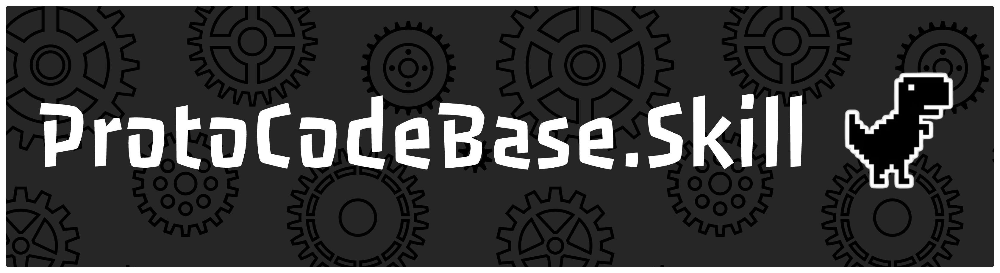

<div align="center">

# ProtoCodeBase Skills
ProtoCodeBase 生态系统的 Agent 技能仓库

[](LICENSE)

<p align="center">
  
</p>

[GitHub Pages](https://ohmyyuwan.github.io/ProtoCodeBase.Skill/) · [English](./README_EN.md) · 简体中文

</div>

# ProtoCodeBase

不要让你的 Agent 造轮子。

让它少读一点，少猜一点，少在上下文里迷路。  
让它站在成熟软件的骨架上，沿着真实工业模板，把你的需求变成可以落地的代码。

ProtoCodeBase 关心的不是“让 Agent 写更多代码”，而是让 Agent 更快找到那一小块真正可参考的代码，找到那一小块能够修改服务于你的需求的代码。

## 需求先于代码

代码不是目的。需求才是。

一个项目里真正值得保存的，不只是文件本身，还有需求如何被理解、如何被拆解、如何被计划、如何被执行。

你的 `Intent` 就是需求本身。它来自你，不需要被协议伪装成另一种对象。

ProtoCodeBase 真正持久化的是程序把需求整理之后形成的工程链路：

```text
Intent    →    Request          →  Plan         →  Change
你的需求        自动转化项目请求       自主计划         计划实施的具体变更
```

程序把你的需求整理成可执行的 `Request`。  
Agent 将请求展开成有边界的 `Plan`。  
最后，真正落到代码里的，是可追踪的 `Change`。

这让一次软件修改不再只是散落在聊天窗口里的记忆，而是可以被下一次 Agent 接住的工程上下文。

## 省 Token，不是省理解

Agent 最贵的浪费，不是多写几行代码，而是反复走进同一片森林，却找不到你要的那棵树。

如果一个成熟项目是一台完整的高达，就不要让 Agent 每次都从拆零件开始。  
给它一份说明书：哪里是手臂，哪里是传动轴，哪里能改，哪里不能动，改了会影响什么。

ProtoCodeBase 用项目三层结构为 Agent 留下这份说明书：

```text
Capabilities  →  Project Map  →  Route
功能能力          项目地图          目标路由
```

- `Capabilities` 描述这个 App 实际能做什么，以及每个能力的边界。
- `Project Map` 描述项目如何组织，哪些模块承载哪些责任。
- `Route` 帮 Agent 从需求直接定位到目标代码、目标组件、目标服务。

这样，Agent 不必把整个仓库塞进上下文。它可以放心 free 掉旧上文，只保留被规范化的工作信息；下一次回来，也能从说明书里重新找到目标位置。

## 参考成熟工业模板

不要从空白文件开始幻想一个系统。

文件管理、权限、协作、编辑器、工作流、历史记录、部署方式、错误处理、用户界面，这些需求早已在成熟软件里反复出现。ProtoCodeBase 希望把这些被验证过的工程结构沉淀下来，让你的 Agent 能够参考、裁剪、合并，而不是重复发明。

与其创造，不如继承。  
与其盲写，不如沿着工业实践修改。  
与其让 Agent 在海量 token 中搜索细节，不如让代码先告诉它：需求应该走哪条路。

## 安装

安装 ProtoCodeBase 技能：

```bash
npx skills add https://github.com/OhMyYuwan/ProtoCodeBase.Skill.git --skill acp-v1-0-0
```

具体 Skill、协议版本和项目声明方式见 [skills/README.md](./skills/README.md)。

## 许可

本仓库的 Skill wrapper、registry、脚本和仓库文档采用 MIT License，详见
[LICENSE](./LICENSE)。

注意：各 Skill 中 bundled 的协议正文、编译产物和 reference package 可能带有
自己的 LICENSE。它们不因根目录 MIT License 自动重新授权。详见
[NOTICE](./NOTICE)。
